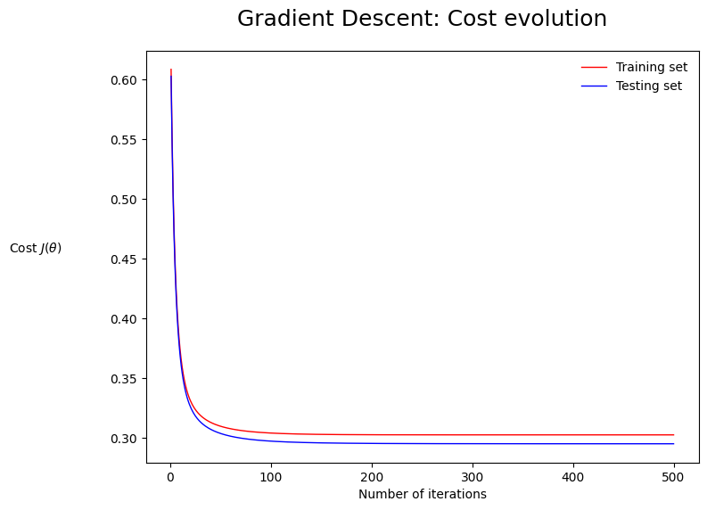

# **Calorimeter Showers Classifier by Hand**

## **Introduction: Calorimeter Showers**

In experimental particle physics, calorimeters measure the energy of incoming particles. For this project, we focus on **electromagnetic calorimeters** at CERN's Large Hadron Collider, such as ATLAS and CMS, which measure energy from incoming electrons. The key characteristics of these showers are their **depth** (directional length) and **width** (perpendicular dimension).

The challenge is to build a classifier that distinguishes **electron showers (signal)** from **hadron showers (background)** based on their depth and width.

**Visual Representation**: Below is a depiction of electron and hadron showers.


---

## **Objective**
Develop a binary classifier to:
- Select electron showers.
- Reject hadron showers.

### **Steps**:
1. Data acquisition and preprocessing.
2. Implementing scaling techniques.
3. Structuring data for machine learning.
4. Designing core functions for classification.
5. Implementing gradient descent optimization.
6. Assessing performance and visualizing results.

---

## **1. Data Acquisition**

#### **Steps**:
- Download the dataset and load it into a Pandas DataFrame.
- Inspect the dataset to identify its structure, features, and labels.

```python
import pandas as pd
import numpy as np

# Load dataset
df = pd.read_csv("dataset.csv")
print(df.head())
```

---

## **2. Feature Scaling**

### **Why Scaling?**
Gradient descent performs better when data is zero-centered and scaled to unit variance. Without scaling, unbalanced feature values can lead to inefficiencies in optimization.

### **Standardization Formula**
\[
x_{scaled} = \frac{x - \text{mean}(x)}{\text{std}(x)}
\]

```python
# Standardizing features
df['shower_depth_scaled'] = (df['shower_depth'] - df['shower_depth'].mean()) / df['shower_depth'].std()
df['shower_width_scaled'] = (df['shower_width'] - df['shower_width'].mean()) / df['shower_width'].std()

print(df.describe())
```

---

## **3. Data Preparation**

### **Steps**:
1. Add a bias term \( x_0 = 1 \) to account for the intercept term in the hypothesis function.
2. Convert categorical labels into binary values: 1 for "electron" and 0 for "hadron".
3. Split the dataset into training and testing sets.

```python
from sklearn.model_selection import train_test_split

X = df[['x0', 'shower_depth_scaled', 'shower_width_scaled']]
y = df['y']

X_train, X_test, y_train, y_test = train_test_split(X, y, test_size=0.2, random_state=42)
```

---

## **4. Core Functions for Classification**

### **Hypothesis Function**
\[
h_{\theta}(x) = \frac{1}{1 + e^{-\theta^T x}}
\]

```python
def sigmoid(z):
    return 1 / (1 + np.exp(-z))

def hypothesis(X, theta):
    return sigmoid(np.dot(X, theta))
```

---

## **5. Training and Visualizing Results**

### **Training the Classifier**
Set hyperparameters and train the model using gradient descent.

```python
# Initialize parameters
theta = np.random.rand(X_train.shape[1])
alpha = 0.01
epochs = 1000

# Train the model
theta, costs = gradient_descent(X_train.values, y_train.values, theta, alpha, epochs)
```

### **Cost vs. Epochs Plot**
Visualize the convergence of the cost function during training.

```python
import matplotlib.pyplot as plt

plt.plot(range(len(costs)), costs)
plt.xlabel('Epochs')
plt.ylabel('Cost')
plt.title('Cost vs. Epochs')
plt.show()
```

> **cost vs. epochs plot**

---

## **6. Performance Assessment**

### **Metrics**
1. **Accuracy**:
   \[
   \text{Accuracy} = \frac{\text{Correct Predictions}}{\text{Total Predictions}}
   \]
2. **Recall**:
   \[
   \text{Recall} = \frac{\text{True Positives}}{\text{True Positives} + \text{False Negatives}}
   \]

```python
def accuracy(y_true, y_pred):
    return np.mean(y_true == y_pred)

def recall(y_true, y_pred):
    tp = np.sum((y_true == 1) & (y_pred == 1))
    fn = np.sum((y_true == 1) & (y_pred == 0))
    return tp / (tp + fn)

# Evaluate the model
predictions = (hypothesis(X_test.values, theta) >= 0.5).astype(int)
acc = accuracy(y_test.values, predictions)
rec = recall(y_test.values, predictions)
print(f"Accuracy: {acc:.2f}, Recall: {rec:.2f}")
```

---

## **7. Visualizing Decision Boundaries**

### Generate Scatter Plot
Visualize the decision boundary.

```python
plt.scatter(df['shower_depth'], df['shower_width'], c=df['y'], cmap='bwr', alpha=0.7)
plt.xlabel('Shower Depth')
plt.ylabel('Shower Width')
plt.title('Decision Boundary Visualization')
plt.show()
```


**Scatter Plot with Boundaries**:


---

## **Conclusion**
Through this project, we developed a binary classifier by implementing core machine learning functions from scratch. This hands-on approach provides a deeper understanding of foundational machine learning concepts, including gradient descent and logistic regression.

--- 
